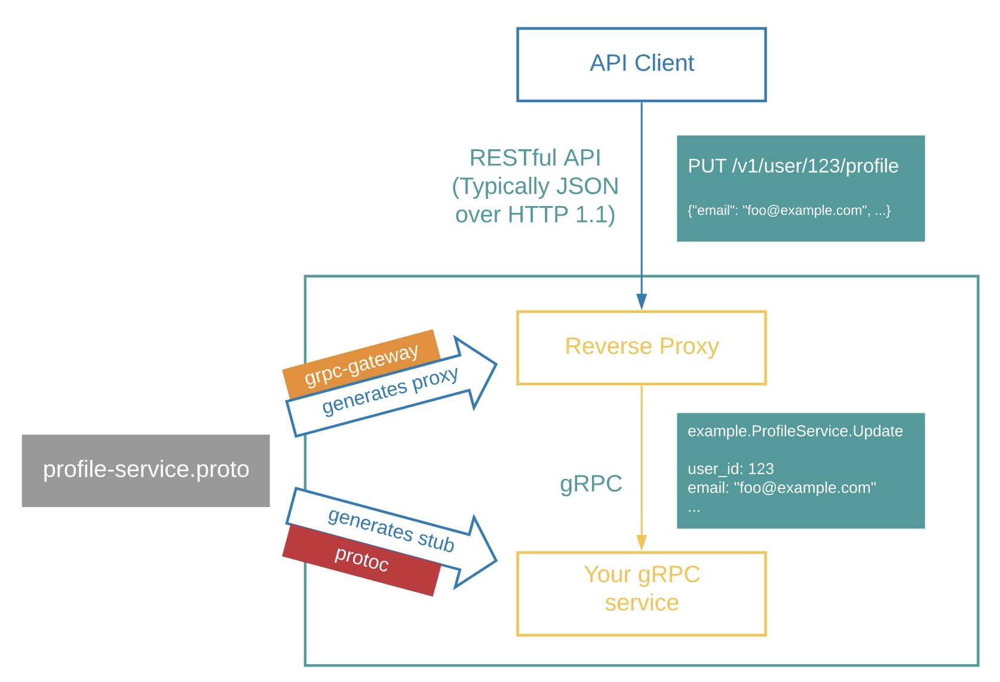

# rs-grpc

基于 Rust 的 gRPC 微服务实战项目，采用 [tonic](https://crates.io/crates/tonic) + [prost](https://crates.io/crates/prost) + [tokio](https://crates.io/crates/tokio) 构建，同时提供 Rust HTTP Gateway、多路复用（Multiplex）服务以及 Go/Node.js 客户端示例。

GitHub: https://github.com/daheige/rs-grpc

---

## 目录

- [核心特性](#核心特性)
- [架构设计](#架构设计)
- [目录结构](#目录结构)
- [环境准备](#环境准备)
- [PB 客户端代码生成](#pb-客户端代码生成)
- [快速开始](#快速开始)
- [客户端使用示例](#客户端使用示例)
- [grpcurl 工具使用](#grpcurl-工具使用)
- [Rust HTTP Gateway 网关设计](#rust-http-gateway-网关设计)
- [Multiplex 服务](#multiplex-服务)
- [日志 logger 使用](#日志-logger-使用)
- [Docker 容器构建](#docker-容器构建)
- [Makefile 命令](#makefile-命令)
- [pb协议托管](#pb协议托管)
- [相关链接](#相关链接)

---

## 核心特性

- **Rust gRPC 服务**：基于 `tonic` + `tokio` 实现高性能异步 gRPC Server。
- **多语言客户端支持**：提供 Rust、Go、Node.js 客户端调用示例及代码生成脚本。
- **gRPC Reflection**：服务端注册反射服务，支持 `grpcurl` 动态发现 proto。
- **Rust HTTP Gateway**：基于 `axum` 实现 HTTP JSON 请求转发到 gRPC 服务。
- **Multiplex 单端口服务**：借助 `tower::steer` 将 gRPC 与 HTTP 服务运行在同一端口。
- **Prometheus 指标**：通过 `autometrics` + `monitor` 暴露 `/metrics` 端点。
- **配置化启动**：使用 YAML 配置文件，结合 `config` 库读取应用配置。
- **优雅停机**：集成 `shutdown` 库实现信号捕获与优雅退出。
- **Docker 化部署**：提供 `Dockerfile`、`Dockerfile-gateway` 及 `Makefile` 一键构建运行。

---

## 架构设计

```text
┌─────────────────┐      HTTP/JSON       ┌──────────────────┐      gRPC       ┌─────────────────┐
│   HTTP Client   │ ───────────────────▶ │  rs-grpc-gateway │ ──────────────▶ │   rs-grpc       │
└─────────────────┘                      └──────────────────┘                 └─────────────────┘
                                              │                                      │
                                              ▼                                      ▼
                                       /metrics:8091                          /metrics:8090

┌─────────────────┐                                              ┌─────────────────────────────┐
│   gRPC Client   │ ───────────────────────────────────────────▶ │  rs-multiplex-svc (gRPC+HTTP│
└─────────────────┘                                              │  on port 8081)              │
                                                                 └─────────────────────────────┘
```

- **rs-grpc**：纯 gRPC 服务，监听 `grpc_port`（默认 `50051`），并暴露 `/metrics`（默认 `8090`）。
- **rs-grpc-gateway**：独立 HTTP 网关，监听 `gateway_port`（默认 `8080`），将 HTTP 请求转换为 gRPC 调用。
- **rs-multiplex-svc**：gRPC 与 HTTP 共用端口（默认 `8081`），通过 `Content-Type` 判断请求类型并路由。
- **rs-rpc-client**：Rust gRPC 客户端示例。

---

## 目录结构

```text
rs-grpc/
├── app.yaml                  # rs-grpc 服务配置文件
├── app-gw.yaml               # gateway 服务配置文件
├── bin/                      # 脚本目录
│   ├── go-gen.sh             # 生成 Go gRPC/gateway 代码
│   ├── nodejs-gen.sh         # 生成 Node.js gRPC 代码
│   ├── docker-rpc-build.sh
│   └── entrypoint.sh
├── build.rs                  # Rust PB 代码生成构建脚本
├── Cargo.toml
├── clients/                  # 多语言客户端示例
│   ├── go/
│   │   ├── client.go
│   │   └── pb/
│   └── nodejs/
│       ├── hello.js
│       └── pb/
├── gateway/                  # Rust HTTP Gateway
│   ├── main.rs
│   ├── app.rs
│   └── rust_grpc/
├── proto/                    # proto 定义
│   ├── hello.proto
│   └── google/api/annotations.proto
├── src/                      # Rust gRPC 服务源码
│   ├── main.rs               # 纯 gRPC Server
│   ├── client.rs             # Rust 客户端
│   ├── multiplex_server.rs   # gRPC + HTTP 多路复用服务
│   ├── app.rs                # 配置读取
│   └── rust_grpc/            # 生成的 Rust PB 代码
├── utils/                    # Go 工具包
├── Dockerfile
├── Dockerfile-gateway
├── Dockerfile-dev
└── Makefile
```

---

## 环境准备

### 1. 安装 Go

访问 https://go.dev/dl/ 下载并安装，推荐 Linux 或 macOS。安装后设置代理：

```shell
go env -w GOPROXY=https://goproxy.cn,direct
```

### 2. 安装 protoc

**macOS：**

```shell
brew install automake libtool protobuf
```

**Linux：**

```shell
PB_REL="https://github.com/protocolbuffers/protobuf/releases"
curl -LO $PB_REL/download/v3.15.8/protoc-3.15.8-linux-x86_64.zip
unzip -o protoc-3.15.8-linux-x86_64.zip -d $HOME/.local
export PATH=$HOME/.local/bin:$PATH  # 建议加入 ~/.bashrc
protoc --version
```

### 3. 安装 Rust

```shell
export RUSTUP_DIST_SERVER=https://mirrors.ustc.edu.cn/rust-static
export RUSTUP_UPDATE_ROOT=https://mirrors.ustc.edu.cn/rust-static/rustup
curl --proto '=https' --tlsv1.2 -sSf https://sh.rustup.rs | sh
```

建议配置 `~/.cargo/config.toml` 使用国内镜像（ustc / rsproxy 等）。

### 4. 安装 Node.js

访问 https://nodejs.org/zh-cn/download 下载并安装。

---

## PB 客户端代码生成

### Rust 代码生成

Rust PB 代码通过 `build.rs` 在编译时自动生成：

1. 读取 `proto/*.proto` 文件。
2. 生成 Rust gRPC 代码到 `src/rust_grpc/`。
3. 生成 `mod.rs` 并跳过 `google.api.rs`。
4. 为生成的 Message 追加 `serde::Serialize` / `serde::Deserialize`，便于 HTTP JSON 序列化。
5. 同步复制一份到 `gateway/rust_grpc/`（不含 `rpc_descriptor.bin`）。

执行一次编译即可触发：

```shell
cargo build
```

### Go 代码生成

```shell
sh bin/go-gen.sh
```

生成内容：

- `clients/go/pb/hello.pb.go`
- `clients/go/pb/hello_grpc.pb.go`
- `clients/go/pb/hello.pb.gw.go`（grpc-gateway）

### Node.js 代码生成

先安装 `grpc-tools`：

```shell
sh bin/node-grpc-tools.sh
```

再生成代码：

```shell
sh bin/nodejs-gen.sh
```

生成内容：

- `clients/nodejs/pb/hello_pb.js`
- `clients/nodejs/pb/hello_grpc_pb.js`

### 一键生成

```shell
make gen
```

---

## 快速开始

### 1. 启动 gRPC 服务

```shell
cargo run --bin rs-grpc
```

输出示例：

```text
current pid:12345
grpc server run on:0.0.0.0:50051
prometheus at:0.0.0.0:8090/metrics
```

### 2. 测试 Rust 客户端

```shell
cargo run --bin rs-rpc-client
```

### 3. 启动 HTTP Gateway

先确保 `app-gw.yaml` 中的 `grpc_addr` 指向已启动的 gRPC 服务地址：

```yaml
grpc_addr: http://127.0.0.1:50051
```

然后运行：

```shell
cargo run --bin rs-grpc-gateway
```

访问 HTTP 接口：

```shell
curl http://localhost:8080/v1/greeter/say/daheige
```

响应：

```json
{
  "code": 0,
  "message": "ok",
  "data": {
    "message": "hello,daheige"
  }
}
```

### 4. 启动 Multiplex 服务

```shell
cargo run --bin rs-multiplex-svc
```

服务同时提供 gRPC 与 HTTP：

```shell
# gRPC
grpcurl -d '{"name":"daheige"}' -plaintext 127.0.0.1:8081 Hello.Greeter.SayHello

# HTTP
curl http://localhost:8081/v1/greeter/say/daheige
```

---

## 客户端使用示例

### Rust 客户端

```shell
cargo run --bin rs-rpc-client
```

核心代码位于 `src/client.rs`：

```rust
let mut client = GreeterClient::connect("http://127.0.0.1:50051").await?;
let response = client
    .say_hello(Request::new(HelloReq { name: "daheige".into() }))
    .await?;
println!("message:{}", response.into_inner().message);
```

### Go 客户端

```shell
cd clients/go && go run client.go daheige
```

预期输出：

```text
x-request-id:  <uuid>
message:hello,daheige
```

### Node.js 客户端

```shell
cd clients/nodejs && yarn install
node hello.js
```

预期输出：

```text
message: hello,heige
```

---

## grpcurl 工具使用

[grpcurl](https://github.com/fullstorydev/grpcurl) 是一款命令行 gRPC 调试工具，依赖服务端开启 gRPC Reflection。

### 安装

```shell
brew install grpcurl
# 或
go install github.com/fullstorydev/grpcurl/cmd/grpcurl@latest
```

### 查看服务列表

```shell
grpcurl -plaintext 127.0.0.1:50051 list
```

输出：

```text
Hello.Greeter
grpc.reflection.v1alpha.ServerReflection
```

### 查看服务方法

```shell
grpcurl -plaintext 127.0.0.1:50051 describe Hello.Greeter
```

输出：

```text
Hello.Greeter is a service:
service Greeter {
  rpc Healthz ( .Hello.HealthzReq ) returns ( .Hello.HealthzReply );
  rpc SayHello ( .Hello.HelloReq ) returns ( .Hello.HelloReply );
}
```

### 调用 RPC

```shell
grpcurl -d '{"name":"daheige"}' -plaintext 127.0.0.1:50051 Hello.Greeter.SayHello
```

响应：

```json
{
  "message": "hello,daheige"
}
```

---

## Rust HTTP Gateway 网关设计

`gateway/main.rs` 是一个独立的 HTTP Gateway：

- 使用 `axum` 提供 HTTP 服务。
- 将 HTTP Path 参数 `/v1/greeter/say/{name}` 转换为 `HelloReq`。
- 通过 `GreeterClient` 发起 gRPC 调用。
- 将 gRPC 响应包装为统一 JSON 结构返回。
- 通过 `autometrics` 自动埋点，暴露 `/metrics`。

运行前请确保：

1. `src/main.rs` 已启动。
2. `app-gw.yaml` 中的 `grpc_addr` 配置正确。

启动：

```shell
cargo run --bin rs-grpc-gateway
```

测试：

```shell
curl http://localhost:8080/v1/greeter/say/daheige
```

HTTP Gateway 运行机制参考下图：



---

## Multiplex 服务

`src/multiplex_server.rs` 借助 `tower::steer` 将 gRPC 服务与 HTTP 服务合并到单个端口（默认 `8081`）：

- 检测到 `Content-Type: application/grpc` 走 gRPC 路由。
- 其他请求走 axum HTTP 路由。
- 同时暴露 `/metrics`（默认 `8092`）。

启动：

```shell
cargo run --bin rs-multiplex-svc
```

gRPC 测试：

```shell
grpcurl -d '{"name":"daheige"}' -plaintext 127.0.0.1:8081 Hello.Greeter.SayHello
```

HTTP 测试：

```shell
curl http://localhost:8081/v1/greeter/say/daheige
```

---

## 日志 logger 使用

项目通过 `log` + `logger` 库记录日志。日志级别优先级：

```text
error > warn > info > debug > trace
```

本地开发启动时可通过 `RUST_LOG` 环境变量指定级别：

```shell
RUST_LOG=info cargo run --bin rs-grpc
RUST_LOG=info cargo run --bin rs-grpc-gateway
```

生产环境二进制运行：

```shell
RUST_LOG=info /app/rs-grpc
RUST_LOG=info /app/rs-grpc-gateway
```

---

## Docker 容器构建

项目提供 3 个 Dockerfile，分别用于开发环境、rs-grpc 服务与 gateway 服务。

### 1. 开发环境镜像（Dockerfile-dev）

`Dockerfile-dev` 基于 `rust:1.97.1-bullseye`，预装 Rust、Go、Node.js、protoc 等工具，用于统一开发/编译环境。

构建：

```shell
make rust-dev
# 或
# docker build . -f Dockerfile-dev -t rs-grpc-dev:v1.0
```

该镜像Tag为 `rs-grpc-dev:v1.0`，后续 `Dockerfile` 和 `Dockerfile-gateway` 均依赖它作为 builder。

### 2. rs-grpc 服务镜像（Dockerfile）

采用多阶段构建：

- **builder 阶段**：基于 `rs-grpc-dev:v1.0`，执行 `cargo build --release` 编译出 `rs-grpc` 二进制。
- **运行阶段**：基于 `debian:bullseye-slim`，复制编译产物与 `bin/entrypoint.sh`，暴露端口 `50051` 和 `8090`。

构建：

```shell
make rpc-build
# 或
# docker build . -f Dockerfile -t rs-grpc-proj:v1.0
```

运行：

```shell
make rpc-run
# 或
# docker run --name=rpc-svc -p 50051:50051 -p 8090:8090 \
#   -v ./app.yaml:/app/app.yaml -itd rs-grpc-proj:v1.0
```

容器启动后会通过 `bin/entrypoint.sh` 执行 `/app/main`，并读取挂载的 `/app/app.yaml` 配置。

### 3. Gateway 服务镜像（Dockerfile-gateway）

同样采用多阶段构建，编译产物为 `rs-grpc-gateway`，暴露端口 `8080` 和 `8091`。

构建：

```shell
make gateway-build
# 或
# docker build . -f Dockerfile-gateway -t rs-grpc-gateway:v1.0
```

运行：

```shell
make gateway-run
# 或
# docker run --name=rs-gateway -p 8080:8080 -p 8091:8091 \
#   -v ./app-gw.yaml:/app/app-gw.yaml -itd rs-grpc-gateway:v1.0
```

注意：`app-gw.yaml` 中的 `grpc_addr` 需要填写宿主机可访问的 gRPC 服务地址（如 `http://host.docker.internal:50051` 或局域网 IP）。

### 4. 配置文件挂载

- rs-grpc 服务挂载 `app.yaml` 到容器 `/app/app.yaml`。
- gateway 服务挂载 `app-gw.yaml` 到容器 `/app/app-gw.yaml`。
- 可通过 `CONFIG_DIR` 环境变量改变配置目录，默认值为 `./`。

### 5. 常用 Docker 命令

```shell
# 查看日志
docker logs -f rpc-svc
docker logs -f rs-gateway

# 进入容器调试
docker exec -it rpc-svc bash
docker exec -it rs-gateway bash

# 停止并删除
make rpc-stop
make gateway-stop
```

---

## Makefile 命令

| 命令 | 说明 |
| --- | --- |
| `make rust-dev` | 构建 Rust 开发环境镜像 `rs-grpc-dev:v1.0` |
| `make rpc-build` | 构建 rs-grpc 服务镜像 `rs-grpc-proj:v1.0` |
| `make rpc-run` | 启动 rs-grpc 容器 |
| `make rpc-stop` | 停止并删除 rs-grpc 容器 |
| `make rpc-restart` | 重启 rs-grpc 容器 |
| `make rpc-rebuild-run` | 重新构建并运行 rs-grpc |
| `make gateway-build` | 构建 gateway 镜像 `rs-grpc-gateway:v1.0` |
| `make gateway-run` | 启动 gateway 容器 |
| `make gateway-stop` | 停止并删除 gateway 容器 |
| `make gateway-restart` | 重启 gateway 容器 |
| `make gen` | 生成 Go、Node.js、Rust PB 代码 |
| `make gen-go-pb` | 生成 Go PB 代码 |
| `make gen-node-pb` | 生成 Node.js PB 代码 |

快速构建并运行 gRPC 服务：

```shell
make rpc-build
make rpc-run
```

一键重新构建运行：

```shell
make rpc-rebuild-run
```

---

## pb协议托管
一般来说，为了方便pb跨语言项目使用，推荐将pb生成的代码托管到git仓库中。这样在Cargo.toml就可以直接通过git和tag引入。
```toml
# 通过git方式引入 hello-pb 包
hello-pb = { git = "https://github.com/daheige/hello-pb",tag = "v1.1.1" }
```

## 相关链接

- tonic: https://crates.io/crates/tonic
- grpc-gateway (Go): https://github.com/grpc-ecosystem/grpc-gateway
- grpcurl: https://github.com/fullstorydev/grpcurl
- Go gRPC 框架示例: https://github.com/daheige/hephfx
